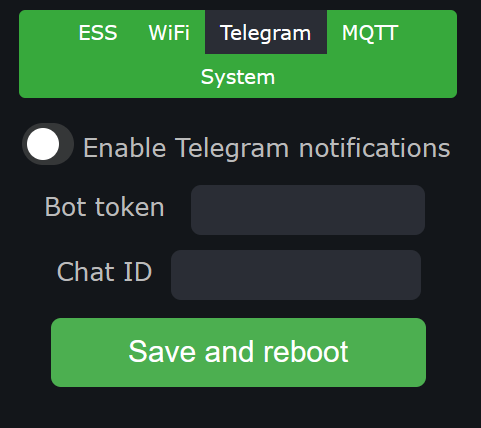

# LG ESS Monitoring Tool

### Схема

**1. esp32 wroom devkit v1**
**2. mcp2515 can-bus module**
**3. 0.96" 128x64 oled display i2c**
**4. USB кабель для esp32**
**5. Ethernet кабель**
**6. Зарядний пристрий USB 5v**

Усі три модулі працють від спільного живлення 5в яке приходить із USB роз'єму. CAN Модуль зєднаний із мікроконтроллером шиною **SPI** а Дизплей за допомогою шини **I2C**.

### Корпус

файли для друку знаходяться у папці STL

## Опис

Блок адаптації був створений для уможливлення роботи батарей LG ESS (CAN) 48V із довільними інвертормаи.

Вся суть роботи полягає в тому що батареї потрібно отримувати keep_alive пакети від інвертора.
У випадку коли такі пакети не будуть отримані батарея відключиться із помилкою за 20 хв.
Блок адаптація посилає цей пакет в кан шину батареї кожну секунду завдяки чому батарея працює в тому режимі в якому це було предбачино виробником.

Батарея у свою чергу отримуючи сигнал від Інвертора починає надсилати інформацію про її стан здоров'я, заряду та інше.
що ми можемо відобразити на дисплеї та у інші способи  про які нижче.

***Блок Адаптації не вносить змін в алгоритм батареї. Більше того! Механізмів як вплинути на роботу батареї(наприклад виключити її) не було знайдено під час процесу аналізу та розбору протоколу***

Протестовано наступні типи батарей:

**EM048126P3S7**

**EM048063P3S5**

**EM048063P3S4**

**RESU 13**

***Увага високовольтні версії із індексом H на даний момент не підтримуються!***

Протестовано наступні марки інверторів в автоматичному режимі роботи Lithium BMS:

Deye - (працює в режимі Lithium, повноцінна робота як батарея PYLONTECH)
LuxPower - (батарея заблокована в режимі Lithium потрібно власника інвертора як добровольця для тестів)

## Інформація отримана із батареї

Щойно отримано інформацію з батареї вона починає відображатися на дисплеї блоку адаптації
весь **програмний код працює таким чином що відображається остання інформація яку було отримано.** іншими словами блок буде відображати останню помилку і стан справ навіть коли батарея вимкнулася аварійно що дозволить швидко зробити налагодження системи.

***У разі виникнення незрозумілих виключень батареї потрібно заживити блок адаптації ESS Monitoring Tool із окремого джерела живлення (PowerBank тощо).***

## Дисплей

### Voltage

| **V** | Поточна напруга батареї | Максимально допустима напруга батареї |
| ------- | ---------------------------------------------- | ------------------------------------------------------------------------- |

### State of Charge / Health

| **C:** | Поточний заряд батареї | Поточний стан здоров'я батареї |
| -------- | -------------------------------------------- | ---------------------------------------------------------- |

***Зверніть увагу що "здоров'я" вираховується контролером батареї і на нашу думку він не відображає фізичного стану батареї. На фото до прикладу батарея не досягнувши напруги повного заряду заблокувала заряд (що свідчить про критичний розбаланс елементів) але контролре всерівно показує 93% здоровя. також із нашого досвіду цей параметр ніяк не відслідковує вздуття елементів. та інших проблем із батареєю!***

### Temperature

По центрі дисплею вказано поточну температуру батареї.
Це досить важливий параметр за яким варто слідкувати адже температура може значно перевищувати навколишню при інтенсивній роботі елементів. Тому слідкуйте аби ваша батарея не нагрівалася надмірно (вище 45 градусів). також критично важливо не заряджати батарею високими струмами коли температура набуває від'ємних значень.

### System Status

Над другою горизонтальною лінією розміщену строку поточного статусу системи. У випадку коли помилок від батареї не зафіксовано строка відображає поточний стан **Wifi**

| **ap:** | назва віфі точки доступу |
| --------- | ----------------------------------------------- |

По замовчуванню блок адаптації ESS Monitor Tool працює в режимі точки доступу **ess-monitor** та паролем **12345678** увійшовши до цієї безпровідної мережі можливо налаштування додаткових опцій завдяки вбудованому **Web Порталу**.

у випадку коли блок адаптації успішно під'єднався до вашої безпровідної мережі буде відображено поточну IP адресу!

| **ip:** | 192.168.0.100 |
| --------- | --------------- |

### BMS Error

Стан віфі мережі буде приховано у випадку коли батарея передасть код помилки батареї
***Власне батарея постійно передає код помилки із значенням нуль але показувати надпис що помилок немає нашу думку немає змісту***

Помилка складається із 2 цифр перша це помилка Аварії при якій батарея буде вимикатися
друга цифра відповідає за Помилку Уваги (висока напруга, температура, тощо) сама по собі не призводить до виключення батареї але часто передує іншій критичній

| **ERROR:** | Помилка | Опис                                                                               |
| ------------ | ---------------- | ---------------------------------------------------------------------------------------- |
| **ERROR:** | 9 1            | Критичне Розбалансування елементів                     |
| **ERROR:** | 8 0            | Перевищення робочих лімітів батареї по струму! |

***У разі невиконання лімітів батареї інвертором батарея вимкнеться!***

Нам невідомі коди помилок які було задіяно виробником тому ми не можемо надати весь список кодів, працюємо із тим що знаємо.

### Battery Current and Limmits

Остання строка відображає поточні ліміти батареї по струму і поточне навантаження

| **A** | Поточний струм | Ліміт ампер по заряду | Ліміт ампер по розраду |
| ------- | ----------------------------- | ----------------------------------------- | ------------------------------------------- |

***Якщо поточний струм вказано із від'ємним знаком - батарея виснажується. Додатне - заряджає***

Ліміти батареї міняються динамічно як правило за наступною схемою.

Чим більше батарея розряджена тим більше допустимий струм заряду а струм заряду навпаки зменшується чим більше батарея наближається до 0% і навпаки чим більше батарея наблизилася до 100% заряду тим менший струм заряду вона декларує.

## Web Portal

### ESS

За допомогою веб порталу можна переглянути стан батареї.
Загалом перша вкладка повністю повторює функціонал OLED дисплею і дозволяє пререглянути поточний заряд та ліміти батареї

### Wifi

дане меню дозволяє налаштувати під'єднання до домашньої віфі мережі (перевести в блок адаптації в режим вайфай клієнта)

Уважно увівши назву віфі мережі та пароль натисніть клавішу **Save and Reboot**
***Траплялися декілька випадків коли після спроби підключення блоку до віфі мережі він переставав працювати повністю, допомагає повторна прошивка контролера, старайтеся не використовувати в мережі CamelCase або інші спецсимволи, бо ця проблема не є до кінця дослідженна***

після перезавантаження блок адаптації буде пробувати під'єднуватися до мережі і якщо він буде успішним то в строці статусу буде вказано поточну айпі адресу в іншому випадку блок  адаптації перейде назад в режим точки доступу

***Підключення до вайфай обов'язкове для використання функціоналу Сповіщення в Telegram та Home Assistant***

### Telegram

Створивши бота можна передати його токен та айді чату в блок адаптації це дозволить отримувати сповіщення про початок роботи від батареї або про її повний заряд у зручній манері в месенджері телеграм.

***В силу обмеженого часу і використання Home Assistant ця функція є експериментальною і не протестованою***

### MQTT

З останіьою ревізією прошивки для блоку адаптації стала можливість роботи батареї в ролі сенсора для [Home Assistant](https://www.home-assistant.io/) це дозволило зручно контролювати роботу батареї через застосунок у сматрфоні та налаштовувати довільні автоматизації вашого розумного дому (такі як виключення некритичних споживачів через розумні розетки у разі вимкнень світла або сповіщень через улюблений канал звязку)

Для увімкнення функції потрібно ввести адресу MQTT брокера і перезавантажити блок адаптації

***MQTT агент реалізований без застосування шифрування тому в Home Assistant потрібно встановити брокер [EMQX](https://www.emqx.com/en)***

Якщо все було налаштовано вірно в Home Assistant з'явиться новий сенсор

тепер ви можете створювати власні інформаційні панелі які відповідають вашим вимогам

### System

Ця вкладка дозволяє визначити чи система працює стабільно чи не перезаванатажується і чи хороший сигнал вайфай

ми використовуємо його для відладки

## Контакти

Якщо у вас є бажання долучитися до розробки цього програмного забезпечення, надати інформацію для цієї інструкції або просто отримати допомогу і консультацію можете [зв'язатися зі мною через месенджер telegram @tetor](https://t.me/tetor)
